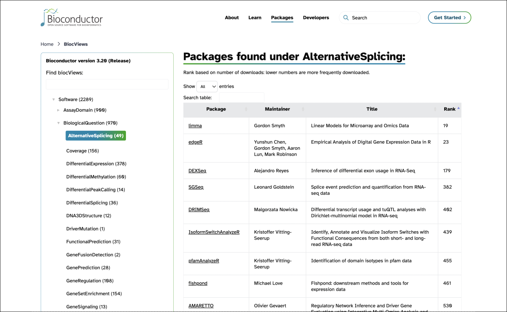
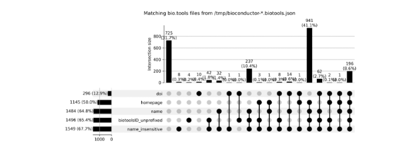
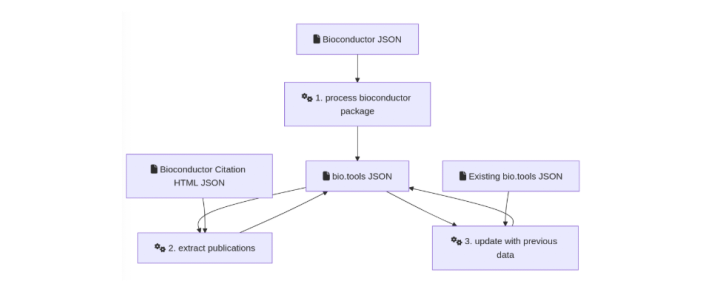

## Abstract

This project seeks to enhance the ELIXIR Research Software Ecosystem (RSEc) by increasing the findability, accessibility, interoperability, and reusability (FAIR principles) of Bioconductor’s extensive collection of over 2,000 bioinformatics packages. By aligning Bioconductor metadata with the EDAM ontology and integrating detailed package descriptions into the bio.tools registry, we aim to improve the discoverability and usability of bioinformatics analysis tools. Short-term goals include mapping Bioconductor’s biocViews controlled vocabulary to EDAM terms, developing a set of manually annotated “gold standard” packages, and evaluating tools for automated EDAM term suggestions. Long-term, we intend to expand EDAM coverage across Bioconductor, phase out biocViews, and implement automated synchronisation with bio.tools. This initiative fosters collaboration between Bioconductor and ELIXIR, establishing a foundation for sustainable software management in European bioinformatics.

Key results from the ELIXIR BioHackathon 2024 week include substantial progress in mapping the biocViews vocabulary to EDAM terms, initiating the curation of a reference set of packages with manual annotations, integrating Bioconductor metadata into the ELIXIR Research Software Ecosystem (RSEc) with automated updates, and prototyping a tool for automated EDAM term suggestions. Together, these achievements establish a strong foundation for further integration and refinement.

# Introduction

## Background

[Bioconductor](https://bioconductor.org/) (Gentleman et al., 2004; Huber et al., 2015\) is a global open-source project that provides over 2,000 packages for biological data analysis within the R programming environment. Supporting a vast range of bioinformatics applications, these tools are widely used for gene expression analysis, visualisation, and data integration, making Bioconductor a critical resource for life sciences research. However, the expanding bioinformatics landscape calls for enhanced methods to locate and apply appropriate tools, especially in complex workflows. Now in its third decade, the Bioconductor project has used a six month release cycle. All resources managed by the project are quality-controlled and revised every release. New resources are reviewed and added and obsolete or unmaintained resources are dropped in a formal deprecation process with a six month cadence.   

The [ELIXIR Research Software Ecosystem (RSEc)](https://research-software-ecosystem.github.io/) (Ienasescu et al., 2023\) promotes the FAIR principles—Findability, Accessibility, Interoperability, and Reusability—, through the centralisation and curation of metadata for computational biology software tools. It relies heavily on the bio.tools registry (Ison et al., 2019\) and the EDAM ontology (Ison et al., 2013; Black et al., 2022\) for the description of bioinformatics tools. EDAM is a domain ontology focusing on concepts related to life science data analysis (Figure 1a). bio.tools holds a collection of more than 30,000 tools, curated and annotated using EDAM terms. It also provides enhanced search capacities and navigation (Figure 1b), and an API for easy programmatic access to the database.

![**a.** EDAM ontology structure. EDAM organises bioinformatics concepts into a hierarchical ontology with four main categories: Data, Format, Operation, and Topic. This formal structure facilitates interoperability by providing standardised, machine-readable annotations that enhance discoverability and integration across bioinformatics tools and platforms. **b.** bio.tools tool page. The bio.tools entry for Bowtie 2 demonstrates how EDAM terms are applied to describe the scientific function of the tool, using EDAM data, operations, formats, and topics.](figures/Figure1ab.png)

## Objectives

Bioconductor uses an *ad hoc* vocabulary for the description of packages called biocViews (Carey et al., 2024), which is structured as a graph with nearly 500 terms describing package attributes (Figure 2). However, it lacks the formal structure of a true ontology, which can limit its utility for automated discovery and interoperability. EDAM, on the other hand, is an OWL-based ontology specifically designed for data analysis and data management concepts in biosciences, making it a better candidate for formalised, interoperable annotations. Aligning Bioconductor packages with this standard aims to enhance tool discoverability within the broader bioinformatics community.



Over the years, multiple initiatives have built connections between Bioconductor and parts of the ELIXIR ecosystem, however no integrated and sustainable solution has been implemented so far.

The long term goals of this project are to (1) annotate more than 2,000 Bioconductor packages using EDAM, and (2) automate their integration with the ELIXIR Research Software Ecosystem and the bio.tools registry. More specifically, our objectives for this BioHackathon included mapping the biocViews taxonomy to EDAM terms, assessing biocViews-EDAM mappings to identify gaps and inconsistencies, curating a reference subset of Bioconductor packages with manual annotations, and developing tools for automated EDAM term suggestions. Additionally, the implementation of automated synchronisation mechanisms between Bioconductor and bio.tools was initiated. 

Beyond advancing the EDAM standard, this initiative builds a collaborative bridge between Bioconductor and ELIXIR. Through structured integration, community-driven development, and quality refinement, this project contributes to ongoing efforts toward a more accessible and interoperable bioinformatics ecosystem.

# Results

## Overview of the BioHackathon results

One of the main goals of the work initiated here is to synchronize the Bioconductor ecosystem with the ELIXIR Research Software Ecosystem, so that all relevant information regarding resources maintained in Bioconductor are automatically updated on the schedule of Bioconductor's six-month release cadence. 

Bioconductor itself maintains four types of packages in the following domains: 

* software for preprocessing and analysis  \vspace{-5mm}  
* annotation related to genome and organism structure and function \vspace{-5mm}   
* curated experiments  \vspace{-5mm}  
* workflow demonstration 

The terms "Software", "Annotation", "Experiment", and "Workflow" are children of the root node of the biocViews vocabulary.

Since bio.tools is specifically intended for software, it does not support data-focused packages such as annotation and experiment packages. While workflow packages (currently only around 30\) may be considered for future inclusion in the RSEc, they are not within the scope of this initial phase, and only "software" tagged packages are therefore currently considered for synchronisation. This decision allows us to focus on software package integration, while laying the groundwork for potentially applying EDAM annotations across all four Bioconductor package types to improve metadata consistency and interoperability in the future.

Key results from the BioHackathon include (1) mapping the biocViews vocabulary with the EDAM ontology, identifying gaps in the ontology and suggesting new terms; (2) defining a set of reference software packages from Bioconductor and manually annotating them, in order to provide a “gold-standard” to evaluate automated annotations; (3) investigate/develop large language model-based tools to automate the annotations; (4) synchronising Bioconductor software packages with the ELIXIR Research Software Ecosystem and (5) developing a BioChatter module to leverage the bio.tools API, enabling users to query Bioconductor package information more intuitively. 

## Mapping biocViews terms with EDAM

The first step for the shifting from biocViews annotations to EDAM annotations consists in mapping the existing vocabulary with the ontology, and identifying potential gaps to be filled in the future. 

**Exploration of software package annotations.** Bioconductor uses the biocViews vocabulary for package annotations. Leaving aside annotation, experiment, and workflow packages, there is a collection of 2,289 software packages to synchronise with the RSEc. Overall, those packages are annotated using 235 different terms, with high disparities in their respective usage (Figure 3a,c). Besides, the number of annotations per package also varies widely (Figure 3b). 


```r
# get software annotations  
annotated_terms <- unique((BiocPkgTools::biocPkgList(version = "3.20", addBiocViewParents = FALSE, repo = c("BioCsoft")) %>%  
  unnest(biocViews))$biocViews)

# make some manual corrections after identifying a few bugs
annotated_terms <- annotated_terms[!annotated_terms %in% c("Scale\nsimulation","Genetics\nCellBiology", "Differential Polyadenylation\nSite Usage", "3' end sequencing", "", NA)]  
annotated_terms <- c(annotated_terms, "Scale", "simulation", "Differential Polyadenylation", "Site Usage", "3p end sequencing")
```

**Exploration of the biocViews vocabulary.** Currently, Bioconductor’s biocViews vocabulary includes a total of 497 terms, of which 175 are meant for software annotation. In order to ensure the consistency of the annotations, an automated validation is performed by [BiocCheck](https://github.com/Bioconductor/BiocCheck/blob/devel/R/checks.R#L160-L183) upon submission of a new package. This ensures that packages include valid biocViews terms and meet the minimum requirement of at least two non-top-level terms. Invalid terms trigger an error during package submission, and recommendations for valid terms are provided using the [`recommendBiocViews`](https://github.com/Bioconductor/biocViews/blob/devel/R/recommendBiocViews.R#L164-L289) function from the `biocViews` package. However, the systematic comparison of this controlled vocabulary against the existing annotations shows that 24 biocViews terms that are not meant for software annotation are used as such nonetheless (Figure 4, blue bar); some packages are annotated with non-valid biocViews terms, likely submitted before the implementation of automated checks, amounting to a total of 51 terms (Fig 4, yellow bar); 15 valid terms are not used at all (Fig 4, orange bar); and 298 biocViews terms that are not meant for software annotation are indeed not used as such (Fig 4, red bar). The latter are thus of minor importance in the current scope of our project.


`# get biocViews vocabulary [R]`
`data(biocViewsVocab)`
`biocviews_df <- biocViewsVocab %>% graph_from_graphnel() %>% as_data_frame(what = "edges")`  
`biocViews_vocab <- unique(sort(c(biocviews_df$from, biocviews_df$to)))`

`# get biocViews software vocabulary [R]`  
`reposPath <- system.file("doc", package="biocViews")`  
`reposUrl <- paste("file://", reposPath, sep="")`   
`biocViews_soft <- names(getBiocSubViews(reposUrl, biocViewsVocab, topTerm="Software"))`

**Mapping results**

We mapped all of the vocabulary considered above against the EDAM ontology using the [text2term](https://github.com/rsgoncalves/text2term) Python library. This library proposes a variety of scoring methods based on string similarity, which may underestimate the actual relevance of a mapped term, or not output a satisfying match when an actually relevant but different term is available in EDAM. Hence, though it provides a good basis for the “translation” of Bioconductor packages annotations into EDAM terms, it requires significant manual curation (See [supplementary spreadsheet](https://docs.google.com/spreadsheets/d/1cJZom4c6GsuClKf0qt79LSJ9BY2PVGB4l5mRO1tkuYY/edit?usp=sharing), “Mapping\_curated” tab \- color code follows Figure 4). 

After curation, the mapped vocabulary was divided into the following 5 categories:

* Good: a perfect match or very close match with an EDAM term \vspace{-5mm}
* Partial: a good enough match with an EDAM term \vspace{-5mm}
* Term suggestion: there is no good match, but curation suggests another existing EDAM term \vspace{-5mm} 
* Term missing: there is no good match, and there is no adequate term available currently in EDAM  \vspace{-5mm}
* Out of scope:  there is no good match, and the term is not in the scope of EDAM  

While a total of 548 terms were mapped (497 biocViews terms \+ 51 non-valid terms) (Fig 5a), for the sake of the present work we will focus on the vocabulary that is either valid or actually used in current software package annotations (250 terms) (Fig 4, Fig 5b-c).

![**a.** A total of 548 terms were mapped to EDAM using the text2term library, of which about half are out of the scope of EDAM. **b.** Setting aside the less relevant terms (Figure 4), 250 curated terms were further considered. 128 terms (51.2%) are mapped correctly; 53 terms (21.2%) do not have good matches but other terms were suggested through manual curation; 31 terms (12.4%) are missing from the ontology, and 38 terms (15.2%) were considered out of the scope of EDAM. **c.** Among the 102 “good” matches, terms were mapped to 60 EDAM topics (58.8%), 32 EDAM operations (31.4%), and 10 EDAM data types (9.8%).](figures/Figure5abc.png)

A list of 29 terms deemed as missing from EDAM was proposed from the 31 curated terms missing a match (See [supplementary spreadsheet](https://docs.google.com/spreadsheets/d/1cJZom4c6GsuClKf0qt79LSJ9BY2PVGB4l5mRO1tkuYY/edit?usp=sharing), “Missing\_terms” tab \- color code follows Figure 4). Among those, a few terms are related to high-throughput technologies and should be considered for addition; a few terms are related to microarray technologies, which triggers questions about their relevance nowadays; a few terms are currently part of a separate, non-released extension of the EDAM ontology;  and 3 terms were once part of EDAM before being made deprecated concepts, and could be reinstated. 

`# save list of all above terms to file [R]`  
`write.table(unique(c(annotated_terms, biocViews_vocab, biocViews_soft)), file = "bioc_all_terms_used.tsv", quote = F, col.names = F, row.names = F, sep = "\t")`

`# map all terms with EDAM using text2term [python]`  
`edam_dev_owl="https://raw.githubusercontent.com/edamontology/edamontology/refs/heads/main/EDAM_dev.owl"`  
`text2term.map_terms(source_terms="bioc_all_terms_used.tsv", target_ontology=edam_dev_owl, min_score=0, save_mappings=True, output_file="mapping_tests_claire/bioc_all_terms_used_mapped.csv", term_type="class", incl_unmapped = True)`

## Defining a reference set of packages

While the translation of the biocViews vocabulary to an EDAM vocabulary is a first step towards the standardisation of Bioconductor software packages metadata, we could go further and take full advantage of the terminology available in EDAM, including topics, operations, formats and data types. This is particularly relevant for their synchronisation with the bio.tools catalogue, and their potential future integration in platforms such as the [WorkflowHub](https://workflowhub.eu/) or the [Galaxy](https://galaxyproject.org/) project. 

Since doing so manually would require a significant amount of time and expertise, we want to explore semi-automated AI-based methods. For this purpose, we decided to create a small list of packages to be curated manually, with two main purposes: serve as a basis for  annotation guidelines, and provide a gold standard to use as a reference in order to evaluate automated annotation strategies. 

We created a reference set of 37 Bioconductor packages (See [supplementary spreadsheet](https://docs.google.com/spreadsheets/d/1cJZom4c6GsuClKf0qt79LSJ9BY2PVGB4l5mRO1tkuYY/edit?usp=sharing), “Reference\_packages” tab), featuring well-known, heavily downloaded packages, as well as those suggested by project contributors and developers, covering a large variety of topics. We initiated their curation (See [supplementary spreadsheet](https://docs.google.com/spreadsheets/d/1cJZom4c6GsuClKf0qt79LSJ9BY2PVGB4l5mRO1tkuYY/edit?usp=sharing), “Package\_curation” tab) which  includes the extraction of existing annotations in bio.tools using the API, revising said annotations, and suggesting new annotations where needed. Some package developers reviewed and updated EDAM annotations in bio.tools for their packages, providing curated examples for future reference ([`xcms`](https://bio.tools/xcms), [`BridgeDbR`](https://bio.tools/bridgedbr), [`rWikiPathways`](https://bio.tools/rwikipathways)).

## Automating EDAM annotations for Bioconductor packages

The biocEDAM package (in development in [github](https://vjcitn.github.io/biocEDAM)) includes functions that operate on content provided in Bioconductor packages to infer EDAM terms appropriate for indexing the package. Briefly, the URL of a PDF or HTML vignette is supplied to the function `vig2data`.  Facilities in the `pdftools` or `rvest` packages are used to extract text for analysis by GPT-4o. The analysis employs prompts defined in the `ellmer` package to produce data on vignette authorship, "topics" identified *ad libitum* by GPT-4o, and a textual summary, called "focus" of no more than 450 words. The "focus" result of `vig2data` is then passed to the `edamize` function, which employs further prompting in connection with data on the EDAM ontology provided in the form of JSON documents. The specific prompt is "Given content about a bioinformatics tool, represent it as a JSON object compliant with the provided schema". Results of this process applied to vignettes from 7 Bioconductor packages (See [supplementary spreadsheet](https://docs.google.com/spreadsheets/d/1cJZom4c6GsuClKf0qt79LSJ9BY2PVGB4l5mRO1tkuYY/edit?usp=sharing), “Automated\_annotation” tab).

The term-to-package assignments achieved through this process seem reasonable. Vignette summaries from two packages, `ChemmineOB` and `phyloseq`, could not be processed by `edamize`. Investigation of these failures is underway.

## Synchronising Bioconductor packages with the ELIXIR RSEc and bio.tools

The synchronization between Bioconductor metadata and both bio.tools and the ELIXIR Research Software Ecosystem (RSEc) has been successfully established, with automated imports from Bioconductor to the RSEc now occurring on a weekly basis (see [https://github.com/research-software-ecosystem/content/tree/master/imports/bioconductor](https://github.com/research-software-ecosystem/content/tree/master/imports/bioconductor) for imported contents from Bioconductor, and [https://github.com/research-software-ecosystem/utils/tree/main/bioconductor-import](https://github.com/research-software-ecosystem/utils/tree/main/bioconductor-import) for the scripts that perform it).

These metadata files consist of:

* JSON metadata retrieved from the Bioconductor package release API, available e.g. at [https://bioconductor.org/packages/json/3.20/bioc/packages.json](https://bioconductor.org/packages/json/3.20/bioc/packages.json).  
* Citation information published in an HTML format on the Bioconductor website, e.g. at [https://www.bioconductor.org/packages/release/bioc/citations/DESeq2/citation.html](https://www.bioconductor.org/packages/release/bioc/citations/DESeq2/citation.html).

Work is currently underway to automate the update of the bio.tools metadata from the Bioconductor metadata files (scripts that will perform this task are under development at [https://github.com/research-software-ecosystem/utils/tree/main/bioconductor-to-biotools](https://github.com/research-software-ecosystem/utils/tree/main/bioconductor-to-biotools)).

The main challenges for this update are:

* to avoid duplication of bio.tools entries for a given Bioconductor package. To reduce this risk, newly created entries in bio.tools will follow a naming convention based on bioconductor package names (i.e. bio.tools ids will be named `bioconductor-{bioconductor package name}`. Existing bioconductor entries, created before the setup of this mechanism, will be automatically detected (based on tool identifier/name or citation information, see figure 7), and retain their old bio.tools identifier.  
* to guarantee that for all packages, metadata available from Bioconductor (e.g., current version, reference citation, etc.) are updated from this source, while information which is only available from bio.tools (e.g. EDAM annotations) is not overwritten. The workflow currently developed will therefore eventually, once the Bioconductor raw files have been imported from Bioconductor, either create new bio.tools entries, or for Bioconductor packages already existing in bio.tools, merge the metadata from Bioconductor and bio.tools. The full workflow as currently envisioned is illustrated in Figure 8\.





Upon finalisation, package information regarding the 2289 Bioconductor packages will be available and automatically updated not only in the RSEc but also in bio.tools, with 1507 updated entries and 289 new entries (numbers upon publication of this report).

## Enhancing user querying of tools with an AI-based conversational agent

BioChatter is an open-source framework for the customisation of LLM-driven systems for applications in biomedical research (Lobentanzer et al., 2025). In addition to introducing transparency, flexibility, and open-source principles into the interaction with LLMs at a scientific level, one focus is on allowing tool use by LLMs by implementing dedicated modules that characterise the tool; for instance, by describing a web API, the programmatic use of this API can be facilitated via the LLM.

A prototype of a [BioChatter](https://biochatter.org/) module was initiated to leverage the bio.tools API, enabling users to query Bioconductor package information more intuitively. The module interprets natural language questions, translates them into bio.tools API calls, and retrieves relevant package details based on EDAM terms and other metadata. This approach is intended to support complex, context-specific queries, enhancing users’ ability to identify suitable Bioconductor tools for particular bioinformatics applications.

To advance BioChatter, we are seeking specific user questions and expected outcomes to develop well-defined use cases. These examples will guide the API’s natural language processing capabilities and refine responses, ensuring alignment with user needs.

# Perspectives

Further collaboration with the Bioconductor community will be necessary to enable the direct maintenance of bio.tools metadata from Bioconductor packages. This will require integrating EDAM-based annotations to describe the scientific functions of the packages, necessitating extensions to the build infrastructure. Several technical approaches are being evaluated. One option is to add [custom fields to the DESCRIPTION file](https://r-pkgs.org/description.html#sec-description-custom-fields) to accommodate one or more EDAM topics. Alternatively, a new annotation file, similar to the CITATION file for bibliographic information, could be used to avoid overloading the DESCRIPTION file or to include information that does not fit the key schema. Formats such as JSON-LD or RDF may be more suitable for this purpose due to their ability to handle ontology concepts and relations. This file could include information about operations and their input and output data and formats, similar to the data available from bio.tools. The format could be modeled after Bioschemas [ComputationalTool](https://bioschemas.org/profiles/ComputationalTool/). Additionally, to streamline maintenance, the Roxygen2 infrastructure and [custom roclets](https://roxygen2.r-lib.org/articles/extending.html#creating-a-new-roclet) could be employed to extract annotations directly from the R source code, similar to the current process for generating DESCRIPTION, NAMESPACE, and manpages.

The automated mapping of biocViews to EDAM offers a promising approach to facilitate this annotation and further metadata standardisation in the scientific description of research software. However, manual review of this mapping will be necessary to address structural differences and gaps in EDAM, thereby ensuring optimal semantic coverage of the scientific capabilities.

The entire corpus of bio.tools and RSEc will also benefit from the natural language querying capabilities provided by the BioChatter module, initiated during the Biohackathon, and pending further development. To enhance BioChatter, we will collect specific user questions and expected outcomes to develop well-defined use cases. These examples will guide the API’s natural language processing capabilities and refine responses, ensuring alignment with user needs.

# Conclusion

Our integration of Bioconductor with the ELIXIR Research Software Ecosystem through this work contributes to ongoing efforts toward enhanced discoverability and interoperability of bioinformatics tools. Mapping biocViews to EDAM, developing annotation prototypes, and exploring sustainable metadata practices have laid the groundwork for a cohesive bioinformatics ecosystem. Continued refinement and automation efforts will ensure Bioconductor resources are accessible and interoperable within ELIXIR’s infrastructure.

## Community and contributions

A roadmap through 2026 will guide future developments of this project, ensuring ongoing collaboration with Bioconductor and ELIXIR communities.

We welcome anyone interested to join our [Bioconductor Slack](https://slack.bioconductor.org/) \#edam-collaboration channel or visit our [working group page](https://workinggroups.bioconductor.org/currently-active-working-groups-committees.html#edam-collaboration). Participation is flexible—members are encouraged to follow updates, drop into discussions, or join our meetings as often or as little as they’d like.

# Data availability

This project utilised multiple resources to support the integration of Bioconductor packages within the ELIXIR Research Software Ecosystem.

* The [biocEDAM GitHub repository](https://vjcitn.github.io/biocEDAM/) served as the primary workspace for EDAM term mapping and developing the edamize() function for automated annotations.

* Bioconductor metadata imports were added to the [ELIXIR RSEc GitHub data repository](https://github.com/research-software-ecosystem/content/tree/master/imports/bioconductor). Code for the automation of these imports and the analysis/transformation of the data is available on the [ELIXIR RSEc GitHub utils repository](https://github.com/research-software-ecosystem/utils)

* A [BioChatter prototype module](https://github.com/biocypher/biochatter/blob/main/biochatter/api_agent/web/bio_tools.py) has been developed to support natural language querying via the bio.tools API, to be refined with additional use cases. 

# Acknowledgements

This work was performed during the ELIXIR BioHackathon Europe 2024 organised by ELIXIR in November 2024\. This work was supported by [ELIXIR](https://elixir-europe.org/), the research infrastructure for life science data. CR is part of the Institut Français de Bioinformatique (IFB, UAR 3601), funded by the Programme d’Investissements d’Avenir subsidised by the Agence Nationale de la Recherche, number ANR-11-INBS-0013. This work was supported in part by NHGRI U24HG004059 “Bioconductor: An Open-Source, Open-Development Computing Resource for Genomics”. This project has been made possible in part by grants 2024-XXX (TODO: Add Vince’s CZI EOSS6 grant id), 2024-342819 and 2024-342820 from the Chan Zuckerberg Initiative DAF, an advised fund of Silicon Valley Community Foundation. SN acknowledges funding from the German Federal Ministry of Education and Research in the frame of de.NBI/ELIXIR-DE (W-de.NBI-11).

# References
